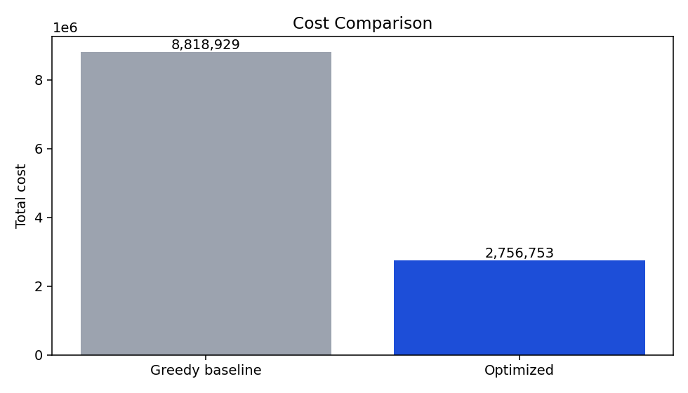
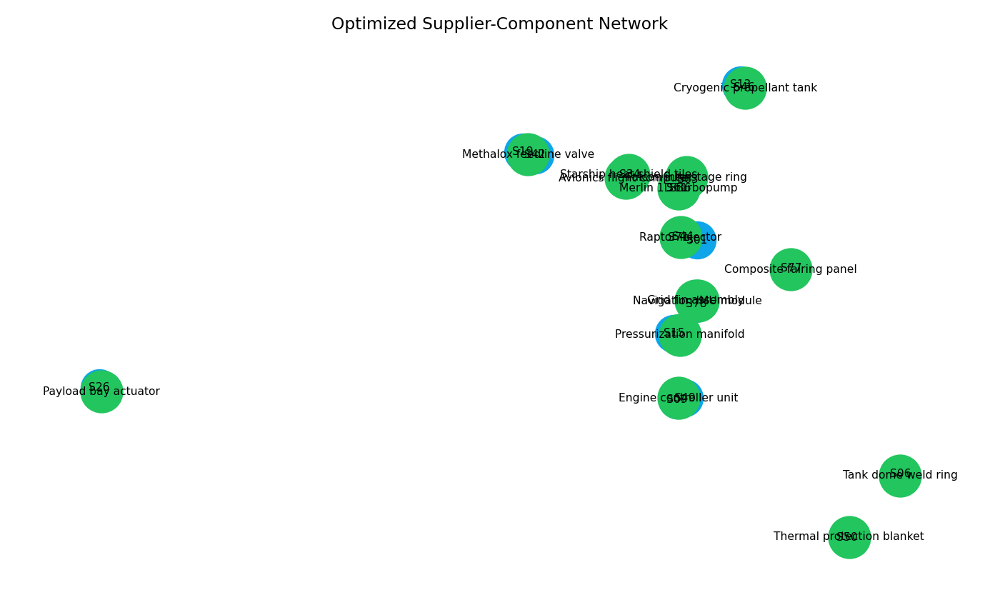
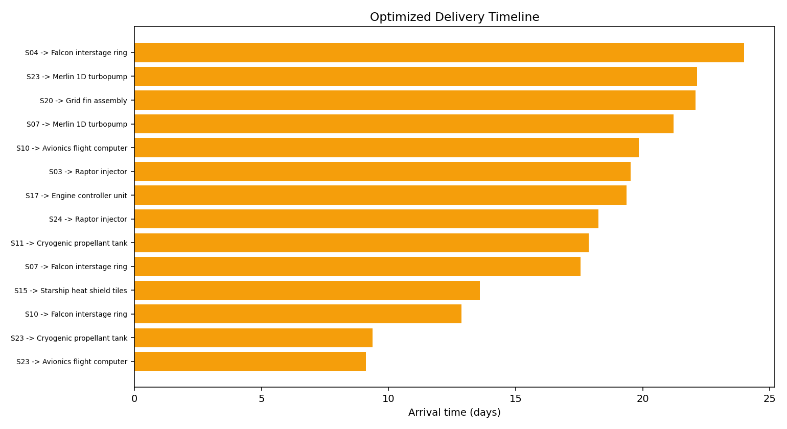

# Aerospace Supply Chain Optimization

## Project Objective

This project builds a practical decision workflow for supply planning under uncertainty.
It combines machine learning and optimization in one pipeline.

The goal is simple: choose suppliers and quantities that satisfy demand, meet deadlines, and stay within budget, while also controlling risk and carbon impact.

## Dataset

The dataset is synthetic, but it is designed to look like real planning data.
It is generated in `src/data_generation.py` and saved as `data/supply_chain_dataset.csv`.

- Source: synthetic generator with aerospace-style components and supplier lanes
- Size: 200 rows and 26 columns in the current dataset
- Unit of observation: one supplier-component lane
- Core features:
	- cost and fixed activation penalty
	- lead time and capacity
	- reliability, weather risk, geopolitical risk, bottleneck risk
	- transport mode and distance
	- telemetry anomaly signals
	- carbon intensity per unit (`carbon_kg_per_unit`)
- Prediction target: `delay_days`



## Methodology

### 1. Delay Prediction Model

I train a Gradient Boosting Regressor to estimate delay days for each supplier-component lane.
The model uses operational features and telemetry anomaly features.

Input examples include unit cost, lead time, supplier reliability, transport mode, bottleneck risk, and anomaly indicators.
The output is a non-negative delay estimate in days.

### 2. Robust Procurement Optimization

I solve a mixed-integer linear program.
The main decision is how many units to buy on each lane, and whether that lane is activated.

The optimizer enforces key constraints:
- each component demand must be covered
- lane capacity cannot be exceeded
- pure procurement spend must stay under budget
- selected lanes must remain feasible under robust deadline logic

The objective balances three forces: total cost, supply risk, and carbon emissions.

### 3. Uncertainty Handling and Trade-Off Analysis

Delay uncertainty is modeled with Monte Carlo scenarios sampled from model residual spread.
From these scenarios, I compute expected delays and quantile worst-case delays.

Then I run a Pareto-style sweep over risk weight values.
This shows how total cost changes when the plan becomes more risk-averse.




## Key Equations

Delay prediction:

$$
\hat{d}_i = f(x_i)
$$

This means the model maps lane features $x_i$ to a predicted delay $\hat{d}_i$.

Expected delay from scenarios:

$$
\bar{d}_i = \frac{1}{S} \sum_{s=1}^{S} d_{i,s}
$$

This is the average delay over $S$ sampled scenarios for lane $i$.

Quantile worst-case delay:

$$
d_i^{(q)} = \mathrm{Quantile}_q\left(d_{i,1}, \dots, d_{i,S}\right)
$$

This captures a high-risk delay level (for example $q = 0.9$) instead of only the mean.

Optimization objective:

$$
\min \ (1-\omega)\left[\sum_i c_i x_i + \sum_i p_i y_i + \lambda\sum_i \bar{d}_i x_i\right]
+ \omega\,\kappa\sum_i r_i x_i
+ \mu\,\kappa\sum_i \gamma_i x_i
$$

This objective minimizes cost plus expected delay, then adds weighted risk and carbon terms.
Here, $x_i$ is quantity, $y_i$ is lane activation, $c_i$ is unit cost, $p_i$ is fixed penalty, $r_i$ is risk coefficient, and $\gamma_i$ is carbon per unit.

Demand constraint:

$$
\sum_{i \in \mathcal{I}_j} x_i \ge D_j
$$

For each component $j$, bought quantity must be at least required demand $D_j$.

Capacity-linking constraint:

$$
x_i \le C_i y_i
$$

If a lane is inactive ($y_i=0$), quantity must be zero.
If active, quantity cannot exceed capacity $C_i$.

Robust deadline envelope:

$$
\ell_i + d_i^{(q)} \le T + M(1-y_i)
$$

If lane $i$ is selected, lead time plus quantile delay must remain below deadline $T$.

Budget constraint:

$$
\sum_i c_i x_i \le B
$$

Total procurement spend is limited by budget $B$.

## Evaluation

Metrics below come from `results/summary.json`.
Values are exact from the latest run.

- Optimization status: Optimal
- Baseline total cost: 8,818,928.948578646
- Optimized total cost: 2,756,752.682807231
- Cost reduction ratio: 0.687405046703371
- Cost reduction percentage: 68.7405046703371%
- Procurement cost term: 2,715,767.7658121586
- Fixed cost term: 27,154.235047914324
- Delay cost term: 13,830.681947157895
- Risk score: 9.481680843883296
- Carbon score (kgCO2e): 10,281.644670650603
- On-time rate (robust): 1.0
- Delay model MAE (days): 1.4795475384481278
- Delay model RMSE (days): 1.9149120662572856
- Delay model residual std (days): 1.9148612666467366
- Solver time (seconds): 0.13788269995711744
- Scenario count: 80

## Repository Structure

```text
.
├─ app.py
├─ optimize.py
├─ README.md
├─ requirements.txt
├─ run_pipeline.ps1
├─ run_streamlit.ps1
├─ run_tests.ps1
├─ data/
│  └─ supply_chain_dataset.csv
├─ src/
│  ├─ data_generation.py
│  ├─ delay_predictor.py
│  ├─ optimizer.py
│  └─ graph_visualization.py
├─ notebooks/
│  ├─ 01_data_preparation.ipynb
│  ├─ 02_delay_prediction.ipynb
│  ├─ 03_optimization_model.ipynb
│  └─ 04_results.ipynb
├─ results/
│  ├─ baseline_plan.csv
│  ├─ optimized_plan.csv
│  ├─ pareto_front.csv
│  ├─ pareto_front.html
│  ├─ cost_reduction.png
│  ├─ optimized_network.png
│  ├─ delivery_timeline.png
│  └─ summary.json
└─ tests/
	 └─ test_pipeline.py
```

## Installation and Execution

1. Create and activate a virtual environment.

```powershell
python -m venv .venv
.\.venv\Scripts\Activate.ps1
```

2. Install dependencies.

```powershell
pip install -r requirements.txt
```

3. Run the full pipeline (data/model/optimization/figures).

```powershell
.\run_pipeline.ps1
```

If your machine blocks local PowerShell scripts, run with:

```powershell
powershell -ExecutionPolicy Bypass -File .\run_pipeline.ps1
```

You can pass custom arguments to the optimizer.

```powershell
.\run_pipeline.ps1 --suppliers 25 --components 8 --budget 0 --deadline 28 --delay-penalty 4.0 --scenarios 80 --risk-weight 0.2 --carbon-weight 0.1 --run-pareto
```

4. Run tests.

```powershell
.\run_tests.ps1
```

5. Start the interactive dashboard.

```powershell
.\run_streamlit.ps1
```


